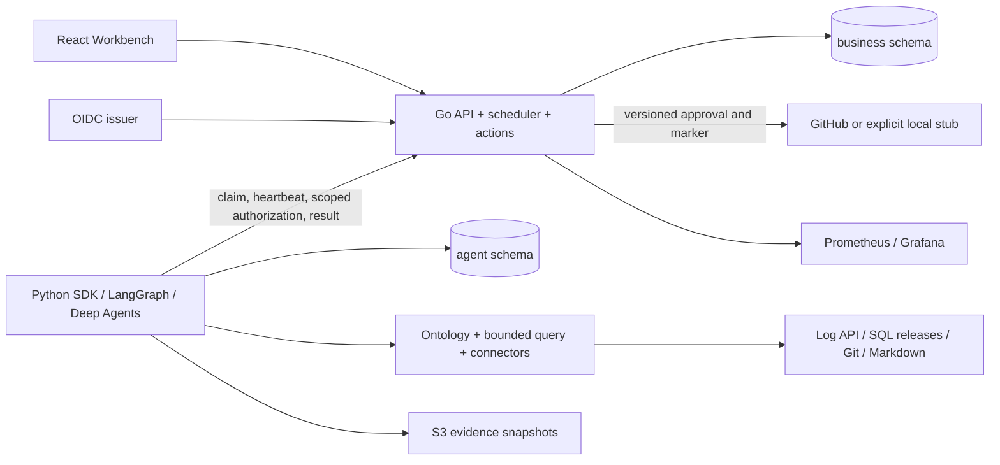

# IncidentDesk architecture

Role grants: API owns business only; Agent owns agent only; source reader has SELECT only in sources. The demo seed process is a development fixture with bootstrap privileges and is not the Agent. Secrets for external writes exist only in Go. A trusted worker identity never substitutes for the stored investigation owner's current membership.

Queue claims serialize global count and use row locks with SKIP LOCKED. Network calls take place outside transactions. Ten active investigations globally, three concurrent slots per worker by default, four attempts per task, 15 second lease, three second heartbeats. API pool limit is 12 per replica. Four APIs + three workers need fewer than 70 steady DB connections, below the development PostgreSQL default 100; source queries/checkpoint operations are short-lived.

Action creation is its own durable queue (`approved` rows). Action dispatch persists `executing`, validates the approved version, evidence watermark, current approver role and repository. Success requires external readback. A crash/timeout turns into marker-based reconciliation, never an automatic second POST. Reconciliation scans at most 500 recent issues; absence or ambiguity remains unknown for manual review.

LangGraph checkpoints use `investigation:generation` thread IDs. An old process may finish writing its own obsolete namespace; Go fencing prevents publication. The replacement does not share a mutable namespace. Checkpoint recovery reauthorizes and checks freshness; it does not reuse approvals. Offline replay uses only recorded results, never online fallbacks.

Local fixtures are labelled: password-based development OIDC issuer with RS256 discovery/JWKS; generated Git commits are in a local repo; Issue HTTP stub is persistent SQLite; deterministic reports are not model quality evidence. Real identity providers can replace the issuer in Go; real GitHub uses GITHUB_API_URL and Go-only GITHUB_TOKEN; configured models use HARNESS=deepagents.
