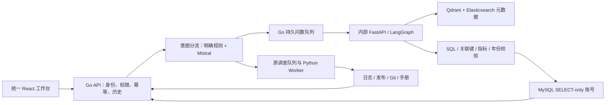

# 统一查询第一版：合并说明与验收

日期：2026-09-24。状态：已在本机合并、部署，完成初步自动验收与页面检查，供用户手动测试。产品范围是“同一登录、同一自然语言入口、同一历史列表下查询业务数据或研发资料”。不是任意企业数据、网站或本机文件搜索。

## 入口与使用

统一入口：http://localhost:8088/ 。Alice / `demo-password` 可试用电商数仓和订单服务资料；Bob 同属订单团队；Carol 只能访问支付团队资料；Admin 管理配置，不自动获得业务数据权限。

首页输入一句话，默认自动识别；也可以选择“业务数据”或“日志与证据”。业务查询后台执行，刷新后可从历史重开结果。2026-09-25 起，自动模式支持普通问答与当前页面连续追问，详见 [CONVERSATION_V1.md](CONVERSATION_V1.md)。

可以先测试：

- `2025年第一季度各地区的销售额，按金额从高到低排序`
- `2025年第一季度的客单价是多少？保留两位小数`：预期 2427.47。
- `查询华东地区2025年第一季度销售额最高的前5个商品`
- `今年我们一共卖了多少钱？`：2026 年没有演示订单，返回空聚合值；不能偷换成 2025 年销售额。
- `订单服务的连接池配置文件在哪？`：基于版本化 Git 证据定位 `config.json`。
- `订单服务的数据库备份操作文档在哪？`：当前资料没有该文档，明确未找到，进入等待补充。

数仓只有 115 条课程订单、5 张表、24 个字段，时间范围 2025-01-01 至 2025-03-31。原来的千万行公开日志仍保留为独立基准环境；它不等于此次电商 SQL 的大规模验收数据。

## 如何取两边的优点

| 来源 | 保留并合入的能力 |
|---|---|
| 原 IncidentDesk | Go 登录认证、当前权限复验、持久化任务与历史、幂等请求、日志/发布/Git/手册证据、审批与动作边界 |
| shopkeeper-agent | FastAPI + LangGraph 查询流程、Qdrant 字段和指标检索、Elasticsearch 中文字段值检索、MySQL 查询与纠错 |
| 本轮整合 | 自动分流、同一 React 工作台、SQL 结果表格与来源、Go 后台问数队列、重试隔离、内部服务身份、确定性业务口径校验 |

直接源码现在位于 `query/`，进入父项目版本管理，不再依赖 `.local` 克隆或手工补丁启动。原 MIT LICENSE、README 和上游 commit 记录保留在 `query/`。上游为 [didilili/shopkeeper-agent](https://github.com/didilili/shopkeeper-agent)，基线 `8045fa4d61608f58df551fda6cd1a70529bb5b67`。社区整理实现不冒充尚硅谷官方仓库。



两个 Python 服务暂时独立运行：旧调查 Worker 使用 Python 3.12，问数模块使用上游 Python 3.14。它们属于同一个仓库、部署与产品，不强行合并不兼容的依赖环境。

## 分别测试与实际修复

合并前原项目 Go race/vet 与 33 项 Python 测试通过，真实 Mistral 调查取得 4 条证据。问数项目重跑 8 个真实模型案例仅 6 个通过，暴露了上次单轮测试没有稳定发现的问题：

1. 客单价被生成成 `SUM(order_amount)/COUNT(DISTINCT date_id)`。
2. 商品/地区 ID 被错误关联到名称字段，语法正确但返回假空结果。

修复：过滤表字段时保留主键与外键；AOV 元数据明确依赖金额和订单 ID；在校验与最终执行两处检查已知指标口径与关联键。错误 SQL 进入原纠错路径，纠错后仍须重新验证。

合并测试进一步发现并修复：

- “今年”被遗漏，实际查成全部历史：新增指定年份约束检查，验证失败则纠错，无法修好时报告失败。
- 意图分类 JSON 缺字段：改用严格 JSON Schema，范围外问题明确说明可用范围。
- 删除要求被追问成是否删除：统一入口直接说明只读，不提供删除执行流程。
- 重启后旧登录状态过期：前端回到登录页，不停留在失效工作台。
- 查询历史插入结果后不易看到：打开历史结果时自动滚动到结果区域；历史默认显示最近 12 条，可展开更多。

## 本轮验收证据

- [分别测试基线](evidence/merged-v1/baseline/)：原 Go/Python、原 NL2SQL 8 例、原调查端到端。
- [修复前记录](evidence/merged-v1/before-repair.json)：保留问题，不把失败抹掉。
- [最终 26 项端到端验收](evidence/merged-v1/acceptance.json)：26/26。包含业务结果与独立预期值对照、两类原失败各重复两次、年份约束、空值、利润缺字段、拒绝删除、澄清、权限、幂等、结果重读、原调查回归。
- [Go race/vet](evidence/merged-v1/go.txt)：6 个测试函数通过，包含并发领取、租约过期重试、过期任务结果不能覆盖新结果、流中断、原审批与权限回归。
- [问数单元测试](evidence/merged-v1/query-unit.txt)：7 个测试函数通过，覆盖 SQL 限制、关联错误、客单价、年份遗漏、内部服务身份。
- [原 Worker 33 项测试](evidence/merged-v1/baseline/python.txt)；原 Worker 代码本轮未修改。
- [前端构建](evidence/merged-v1/web-build.txt)：TypeScript 与 Vite 通过。
- [元数据重复启动](evidence/merged-v1/init-repeat.txt)：已完成初始化时不重复写入。
- [原提问回归](evidence/merged-v1/original-questions.json)：配置路径与 Git 中真实的 config_path/config 内容相符；缺少备份文档时明确未找到。

数据库 JSONB 不保证字段顺序，测试归一化 Decimal 和结果字段顺序；排行另校验分组顺序，不把 JSON 序列化差异判为业务错误。测试结果只代表这批样例，不等于任意自然语言准确率或生产验收。

浏览器已验证：登录、统一入口提问、后台进度、客单价 2427.47、展开 SQL、刷新后从统一历史重开结果。页面保留原日志调查的证据与审批视图。

## 运行与接口

```sh
# 在项目根目录；复用原 .env 中的 MISTRAL_API_KEY，不写入源码
./scripts/deploy-local.sh

# 最小复测
./scripts/test-go.sh
(cd worker && uv run pytest -q)
(cd query && uv run python -m unittest discover -s tests -v)
(cd web && npm run build)
uv run --project worker python scripts/merged_acceptance.py
```

`compose.yaml` 包含原服务与内部 `query`、`query-mysql`、`query-es`、`query-qdrant`。问数服务和数据存储没有发布宿主机端口，调用必须经过 Go API；内部问数接口校验服务密钥。旧独立 38088/38080 试用入口停用后，统一使用 8088。

新增 API：

- `POST /api/v1/queries`：Bearer token + Idempotency-Key；`text`、`timezone`、`mode=auto|warehouse|investigation`。支持可选 `history`，返回普通回答、澄清，或带 kind 与 id 的持久任务。
- `GET /api/v1/queries`、`GET /api/v1/queries/{id}`：本人创建且当前仍有数据集权限的业务查询。
- `GET /api/v1/datasets`：当前可访问的数据集。
- 日志调查继续使用已有详情、事件、审批与操作接口。

元数据初始化由 `app.scripts.initialize` 完成；标记成功后重复部署不重建。部分初始化失败会停止并提示修复，不删除已有业务数据。迁移 `004_queries.sql` 是增量、可重复执行的。原演示数据与公开日志卷均保留。

## 实际边界

- 当前一个只读电商数据集分配给 orders 团队；没有声称实现任意业务库、多租户行列权限或自助接入。
- SQL 最多 500 行、MySQL 执行超时 5 秒，整条问数最多 120 秒；每人最多 5 个排队/运行查询，两个执行槽位。
- 只读查询异常退出可在租约到期后再尝试一次；旧执行尝试的结果不能覆盖新尝试。没有跨进程取消运行中 SQL 的用户按钮。
- 已知口径与关联校验是针对当前五表模型的保护，不是通用 SQL 语义正确性证明；相对年份之外的复杂时间表达仍需测试。
- 缺少数据时诚实返回空值或原因；当前结果解释采用实际数据库值，不让模型编造数值。
- 本轮未做新的大规模 SQL 压测、独立人工质量评分或新版 Kubernetes 部署；Helm 仍是原调查部署，不宣称已经包含问数。
- 下一阶段先收集用户手动错例，再接入较大结构化数据、完善时间/指标语义和独立回归集。真实 GitHub 写入仍沿用原项目外部授权与审批条件。
