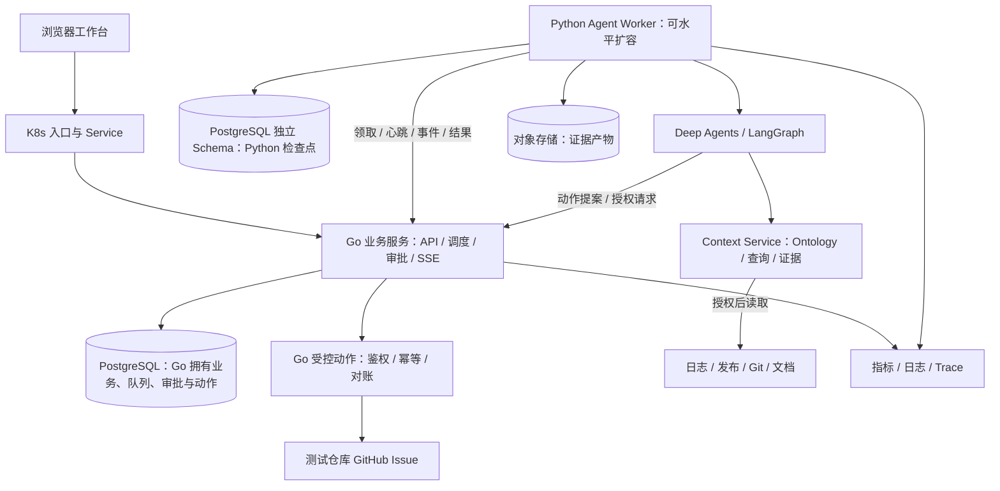

# IncidentDesk 产品需求文档（PRD）v1.5

> 2026-09-25 第三轮修复：自然语言重置上下文现在持久生效，并区分保持条件与执行查询；补上服务就绪检查。详见 [BUGFIX_ROUND3.md](BUGFIX_ROUND3.md)。

> 2026-09-25 第二轮边界修复：草稿隔离、失败恢复、长问题条件保全与历史分页问题已修复，验收见 [BUGFIX_ROUND2.md](BUGFIX_ROUND2.md)。

> 2026-09-25 持久会话更新：新增账号隔离的历史对话、刷新/重新登录恢复、服务端上下文、版本并发控制与安全重试，范围和验收见 [CONVERSATION_MEMORY.md](CONVERSATION_MEMORY.md)。尚未完成独立结构化查询规划。

> 2026-09-25 完整参考范围更新：按尚硅谷当前“掌柜问数”介绍、社区18章教程及京东DataAgent源码分别核查，完整矩阵与后续验收工作项见 [ATGUIGU_CAPABILITIES.md](ATGUIGU_CAPABILITIES.md)。教学主链路已合入，不代表官网当前描述的三阶段规划、完整HyDE或大Schema能力均已完成。继续使用Mistral。

> 2026-09-25 对话入口更新：新增普通问答、语义分流、具体澄清和当前页面连续追问，范围与验收见 [CONVERSATION_V1.md](CONVERSATION_V1.md)。

> 2026-09-24 合并更新：业务问数与研发调查已合并为同一产品。新增需求、边界与本机验收基线见 [MERGED_V1.md](MERGED_V1.md)。下文原调查需求继续保留；新增问数通过本轮测试不代表原全部 P0/生产要求均已完成。

日期：2026-09-24  
产品：企业研发故障调查与处置 Agent  
状态：架构已确认，作为开发与验收基线；功能和指标均需实现后验证  
目标用户：中小研发团队中的值班工程师、服务负责人及技术负责人

本文件独立定义 IncidentDesk 的产品范围、用户流程、系统约束与验收标准。P0 为本期完整交付范围，P1 不阻塞本期交付。本文不代表功能已经实现或验收已经通过。

> 2026-09-25 扩展验收：新增问法、复合指标、单月约束、追问条件保留及代理恢复检查，结果见 [EXTENDED_TESTS.md](EXTENDED_TESTS.md)。

## 1. 产品定义与目标

IncidentDesk 帮助工程师从一条故障描述出发，查询日志、发布记录、代码变更和运行手册，形成带来源的调查结论，并在人工批准后创建可追踪的修复工单。

应用之下提供三块可独立验收的系统能力：**企业上下文服务、受控 Agent 执行服务、运行评估与回归服务**。它们是模块与接口边界，首版不要求拆成三个微服务。只覆盖研发故障领域的有限语义模型，不承诺建设通用 ContextOS。

核心产品承诺：**每个重要判断有证据，每个写入动作有授权，每个长任务有可检查的状态。**

本项目同时承担两类目标：

| 目标 | 成功证据 |
|---|---|
| 产品目标：减少跨系统收集资料和整理工单的重复工作 | 使用者能够完成真实或受控故障的调查与建单，反馈调查资料是否可用 |
| 工程目标：提供可部署、可恢复、可扩展的企业调查服务 | 可运行服务、清晰的数据与权限模型、故障恢复测试、评估结果及架构决策记录 |

产品收益需要通过受控场景和用户试用验证；当前尚未完成目标用户访谈，不预设已验证的效率提升比例。

## 2. 业务场景与用户

### 主场景

某团队的一项服务在发布后出现超时。值班工程师需要分别查看监控日志、代码提交、历史故障和运行手册，确认影响范围，整理可能原因，再创建修复工单交给负责人。

用户输入示例：

> 调查订单服务最近 30 分钟的超时，关联最近一次发布和相关变更，整理证据和下一步建议。经我批准后创建修复工单。

时间范围以明确的时区和起止时间保存。服务不明确时，系统展示可访问服务供用户选择；缺少日志时返回资料缺口，不凭空生成根因。

### 角色与权限

| 角色 | 主要需求 | MVP 权限 |
|---|---|---|
| 调查者 | 快速收集证据、理解问题、准备工单 | 发起及查看所属团队的调查，补充信息，生成和编辑动作草稿 |
| 审批者 | 判断是否执行动作、指定负责人 | 调查者权限，加批准或拒绝所属团队的建单动作 |
| 管理员 | 配置连接、服务归属与成员 | 管理连接及团队配置；管理权限不自动等于全部业务内容读取权限 |

MVP 为一个组织、两个团队、三类角色。用户可以同时拥有多个团队角色；所有团队成员可读取本团队业务资料。更细粒度的文档 ACL 留待后续。

## 3. 范围与优先级

### P0：第一版必须完成

1. **FR-01** 基于已登录用户、服务和时间范围发起调查。
2. **FR-02** 查询四类来源：日志、发布记录、Git 代码变更、Markdown 运行手册。
   K8s 验收阶段将受限的集群事件和工作负载状态加入日志调查工具，支持真实集群故障场景；只读取授权命名空间。
3. **FR-03** 展示调查进度、证据、候选原因和未知项。
4. **FR-04** 持久保存任务；支持等待补充信息、等待审批、取消和进程重启后的恢复。
5. **FR-05** 生成 GitHub Issue 草稿，经批准后向配置的测试仓库创建 Issue。
6. **FR-06** 工具执行阶段校验权限；对建单动作处理幂等与结果未知状态。
7. **FR-07** 展示审计事件，保存可用于离线回归的执行记录。
8. **FR-08** 提供一个能注入故障的演示服务和固定评估样本。
9. **FR-09** 实现 API 与 Worker 分离部署、持久任务队列、并发控制、SSE 断线续传和连接超时治理。
10. **FR-10** 提供 Helm 部署，在本地 Kubernetes 验证多副本、滚动发布、Pod 故障恢复及扩缩容。
11. **FR-11** 交付数据库备份恢复演练、监控看板、CI 校验与后端负载测试报告。
12. **FR-12** 实现研发对象 Ontology、来源语义映射、受约束查询计划、跨源事实组装和可追溯的 ContextBundle。
13. **FR-13** 提供统一 Connector 契约；处理增量同步、删除、版本、访问范围和数据时效；至少跑通结构化表、文档、Git、日志 API 四种适配器。
14. **FR-14** 提供应用自有的 Runtime SDK 契约、有限 Skill / MCP Gateway 和受限分析沙箱路径，业务权限不能被框架默认行为绕过。
15. **FR-15** 实现完整 trace、无副作用离线回放、evaluation hooks、失败样本审核入库与版本回归；积累可审核的企业记忆。

### P1：完成 P0 后按收益决定

- 告警自动触发调查、更丰富的相似工单推荐。
- 将结论追加到已有 Issue，或接入 Jira。
- 分工明确的并行子 Agent，并与单 Agent 基线对比。
- 独立图数据库连接、通用图查询、完整双时态企业记忆、更细粒度文档 ACL。
- 面向真实试用者的部署和反馈入口。

### 本期不做

- Agent 自动回滚、扩缩容被调查服务、修改生产配置或合并 PR。IncidentDesk 自身的 HPA 仍属于本期交付。
- 通用企业 Agent 平台、可视化工作流搭建器、任意代码自主执行。
- 模型训练、全量 AIOps 平台、多租户计费。
- 跨领域的通用 ContextOS 或通用分布式查询引擎。

## 4. 核心用户流程

### 4.1 发起调查

用户选择服务、时间范围并描述症状。系统检查身份、团队权限和连接可用性，创建任务。界面先展示调查范围、可用来源及资料缺口，再进入执行。

### 4.2 调查与证据收集

Agent 提出查询步骤，通过受控工具读取资料。所有查询都限定服务和时间范围，并受步数、时间、输出大小及成本预算约束。

证据卡片至少包含：来源类型、来源定位、采集时间、对应事件时间、版本或内容摘要值、相关内容片段。用户能从结论跳转到对应证据。

系统展示简短执行说明和工具状态，不把模型内部推理过程作为产品内容。

### 4.3 查看结论

报告分为：影响范围、已确认事实、候选原因、反证或冲突、缺失信息、建议下一步。候选原因必须有证据引用；证据不足时允许只给调查建议。

首版使用“证据充分 / 有待验证 / 证据不足”等标签，并附判定规则，不输出未经校准的百分比置信度。

### 4.4 草拟并审批动作

用户选择“生成修复工单”，系统给出目标仓库、标题、正文、证据、负责人建议。用户可以编辑草稿；只有目标团队的审批者可以批准。

审批记录绑定具体动作版本、内容摘要和证据快照。草稿变更后原审批失效。批准时明确展示“将向指定 GitHub 仓库创建一张 Issue”。

### 4.5 执行与确认

执行前重新检查审批有效性、当前权限和目标配置。成功后读取 Issue 并记录编号、URL 与内容，调查页面显示可点击结果。

若请求超时且无法确认是否已经写入，动作进入“结果待核对”，系统先查询对账，暂停自动重复创建。无法消除歧义时要求人工核对。

### 4.6 完成与反馈

调查完成后，用户可以标记结论是否有帮助、候选原因是否确认，并填写最终原因。反馈与原报告分别保存，供后续评估使用。

## 5. 页面与交互

| 页面 | 核心内容 | 主要操作 |
|---|---|---|
| 调查列表 | 服务、发起人、状态、更新时间、是否需处理 | 新建、筛选、进入调查 |
| 调查工作台 | 症状与范围、执行进度、证据列表、结论、动作区域 | 补充信息、取消、查看证据、生成草稿 |
| 动作审批视图 | 目标系统、完整写入内容、版本、审批状态 | 编辑、批准、拒绝 |
| 运行记录 | 工具输入摘要、结果状态、耗时、费用估算、错误、版本 | 查看历史执行和脱敏导出 |
| 管理配置 | 数据连接、团队、成员、服务归属 | 检查连接、调整访问范围 |

不强制独立聊天页面。调查工作台优先保证证据、状态和动作可见，聊天作为补充交互。

本项目以前后端可独立访问的 API 契约为交付基础。Web 工作台仅覆盖必要的调查、证据和审批操作；不开发专门的桌面端、复杂可视化编辑器或替代 Grafana 的监控产品。

## 6. 关键产品规则与异常行为

| 情况 | 预期行为 |
|---|---|
| 某个数据源不可用 | 标明缺失来源，继续允许的只读调查；不声称已检查该来源 |
| 日志与发布记录互相矛盾 | 保留各自来源与时间，展示冲突并提出核验步骤 |
| 工具返回量过大 | 服务端过滤、分页或保存受控产物；展示结果是否截断 |
| 模型输出参数不合法 | 在工具入口拦截，有限次数修正；超限后展示失败原因 |
| 文档内包含“忽略权限”等指令 | 当作业务数据；工具层权限与审批规则不受其影响 |
| 调查过程中用户权限被撤销 | 后续读取、报告访问和动作执行重新鉴权，阻止未授权访问 |
| 审批后修改草稿 | 原审批失效，要求重新审批 |
| 审批后服务出现新发布 | 标记证据过期；P0 将该动作退回重新调查或审批 |
| Worker 崩溃 | 重启后恢复已持久化状态；外部副作用通过动作记录核对 |
| 两次点击批准或并发执行 | 同一动作版本只有一个逻辑执行，返回同一执行记录 |
| 建单接口写入成功但响应丢失 | 进入结果待核对，查找原动作标识；不盲目重建 |
| 用户取消调查 | 停止调度新步骤；标记仍在运行或已完成的外部动作，不能承诺撤销已提交写入 |
| 达到预算上限 | 停止新模型或工具调用，返回已有证据及未完成项 |

## 7. 数据与系统边界

核心对象：User、Team、Service、Deployment、Commit、Document、Incident、Investigation、Evidence、Action、Approval、ExecutionEvent；以及 OntologyVersion、SourceMapping、QueryPlan、Fact、ContextBundle、MemoryEntry、RunManifest、EvaluationCase。

- Service 关联团队、代码仓库和日志来源；Deployment 关联 Service 与 Commit。
- Investigation 关联服务、时间范围、发起人和使用的版本配置。
- Evidence 保存来源定位和快照信息；快照与产物继承团队访问限制。
- Action 保存动作类型、目标、草稿版本和业务幂等键；Approval 绑定该版本。
- ExecutionEvent 记录发生了什么及何时发生，敏感凭据不进入日志或导出。

调查状态：排队、运行中、等待信息、调查完成、部分完成、失败、已取消。

动作状态：草稿、待审批、已拒绝、已批准、执行中、结果待核对、已成功、已失败、审批已失效。

调查与动作分开建模：调查完成不意味着写入成功，审批通过也不意味着外部系统已经改变。

## 8. 已确认架构与系统要求

Go 业务后端 + Python Agent Worker + PostgreSQL + Kubernetes 为已确认架构。下表定义实现边界；具体库、版本、接口字段和部署参数由开发阶段验证并通过 ADR 记录。

| 模块 | 技术方向 | 职责与理由 |
|---|---|---|
| Agent Harness | Deep Agents / LangGraph | 使用规划、工作空间、Skills 和上下文管理等机制 |
| 企业上下文 | 自有对象与关系 Schema、Connector 契约、查询计划和 ContextBundle | 明确语义、证据、时效和访问边界，首版用 PostgreSQL 保存业务关系 |
| 执行状态 | LangGraph 持久化检查点 | 保持一个主要 Agent 状态管理体系，验证中断和恢复 |
| 业务后端 | Go + PostgreSQL；具体 HTTP 路由与数据库库待技术设计 | API、任务调度、身份权限、审批、动作执行、业务审计和 SSE |
| 智能执行 | Python + Deep Agents / LangGraph | 上下文组装、模型和工具循环、Agent 检查点、证据与评估；不拥有业务动作提交权 |
| 跨语言契约 | 版本化 HTTP/JSON + OpenAPI/JSON Schema | 领取任务、心跳、事件上报、结果提交和受控动作接口；首版不引入 gRPC |
| 前端 | React / TypeScript | 构建调查与审批工作台 |
| 工具层 | 自有策略入口，接入窄权限 API 及至少一个 MCP Server | Skill / MCP 共用身份、授权、参数、预算、审批与审计规则 |
| 隔离执行 | 受限分析沙箱，先运行预置日志分析脚本 | 只读输入、隔离输出、默认禁网、资源和时间限制；不开放任意宿主机命令 |
| 部署 | Docker Compose 用于日常开发；kind/k3d + Helm 用于必做部署验收 | 验证多副本、滚动发布、资源限制和故障恢复 |
| 可观测性 | OpenTelemetry + Prometheus / Grafana；日志与 Trace 后端按资源预算启用 | 关联 HTTP 请求、调查任务、工具调用及外部写入，量化瓶颈 |
| 大对象 | S3 兼容对象存储 | 保存日志快照和证据产物，避免数据库与上下文承载大段原始数据 |

MVP 不同时加入 Temporal、第二套 Agent 编排框架和图数据库。若后续需求确实需要，补充架构决策及迁移边界。

子 Agent 只在任务可独立分解且有可测收益时启用。Skills 可用于日志调查、发布比对和报告格式；它们不承担权限判定。MCP 协议接入本身也不等于授权完成。

检查点恢复不等于外部写入恰好一次。GitHub Issue 创建的超时对账、并发互斥和动作标识需要在业务层实现；无法核对时保持未知状态。

### 8.1 后端服务职责

首版采用一个代码仓库，部署 Go 业务服务与 Python Agent Worker。Go 包含 API、持久任务调度和受控动作执行模块，可按实际负载以不同进程角色部署；首版不拆成大量微服务。Python 内包含 Harness、Context Service、读取型 Connector 和评估模块。Python 不直接写 Go 管理的业务表，也不持有绕过 Go 审批所需的工单写入凭据。



| 模块 | 必须实现的后端能力 |
|---|---|
| 身份与权限 | 接入 OIDC 身份源；验证 Token 签名、签发者、受众和有效期；本地角色映射；服务端根据身份决定团队范围 |
| 调查 API | 参数校验、分页、幂等创建、统一错误、请求追踪、限流与团队任务配额 |
| 调度与 Worker | 持久任务领取、租约与心跳、有界重试、退避、取消、超时、失败记录和人工重试入口 |
| 审批与动作 | 状态机、乐观并发控制、审批版本绑定、动作唯一约束、执行前鉴权及结果对账 |
| 事件与进度 | 任务级单调事件序号、持久事件、SSE 重连与按 Last-Event-ID 补发；游标过期时返回快照和新游标 |
| 数据访问 | Schema 迁移、团队过滤、必要索引、事务、连接池、慢查询分析、备份恢复 |
| 外部依赖 | 连接与总超时、并发上限、429/5xx 有界重试、熔断和恢复；不对结果不明的写入自动重试 |

后端需有可独立验收的接口契约：创建调查返回 202 与任务 ID；查询任务和分页列表；带游标读取事件；提交草稿并返回版本；带预期版本批准或拒绝；取消任务；查询动作执行结果。重复幂等请求返回相同逻辑对象，版本冲突返回明确的冲突响应，角色不足和配额耗尽可机器识别。接口名称与字段在 OpenAPI 设计阶段确定。

首版队列选 PostgreSQL 任务表：由 Go 在同一事务中创建调查与待执行任务；Python Worker 经 Go 内部接口领取任务，由 Go 以短事务完成租约分配，Python 在事务外运行 Agent。心跳、取消和结果提交也经内部接口核验服务身份、任务归属与执行代次，禁止持有数据库事务等待 LLM。

LangGraph 检查点仅承担 Agent 状态持久化，不自动提供任务投递、Worker 调度或应用副作用一致性。任务表负责重新调度，检查点负责恢复计算，两者通过任务 ID、执行代次和恢复规则关联。等待审批时释放 Worker 执行槽，审批事务创建恢复任务。

同一调查限制一个有效执行者；旧 Worker 失去租约后，不能提交新状态或启动写动作。技术设计必须明确检查点写入的互斥策略，并用旧 Worker 恢复测试验证。租约无法撤销已经发出的外部请求，该情况仍走结果对账。

业务表和检查点即使放在同一 PostgreSQL 实例，也使用独立 Schema 与数据库角色。Go 不理解 LangGraph 内部状态；Python 无权直接更新审批和业务终态。跨边界采用可重试、可核对的事件/结果协议，不假定业务提交与检查点保存是跨服务原子操作。

跨语言必须验证：协议版本不兼容、结果重复/乱序、回调响应丢失、租约过期、取消后迟到结果、滚动发布时新旧消息格式兼容。Go 的请求 context 取消不自动等于远端任务取消，需显式持久取消状态并由 Worker 响应。

Go 后端的深度验收包含并发限制与背压、优雅退出、数据库竞争、goroutine 泄漏检查、race detector 和 pprof 定位实验；不得把它实现成只转发 Python 请求的薄代理。相关性能改善仅在有前后对照实测时报告。

若压测证明任务表轮询成为瓶颈，后续再采用 Outbox + 消息中间件；Redis、Kafka 等不是首版必选依赖。引入时必须说明消息重复、丢失、数据库与消息一致性的处理方式。

### 8.2 数据一致性与存储要求

- 创建调查、任务入队：同一个数据库事务，接口只有在持久化成功后才返回已受理。
- 批准动作：以动作版本和当前状态作条件更新，批准事件与执行任务同事务提交。
- 动作执行：业务幂等键有数据库唯一约束；外部结果保存独立状态，不能以 HTTP 200 作为唯一成功凭证。
- 原始证据与产物：保存内容摘要、来源和访问范围；对象上传与数据库提交采用阶段状态与孤立对象清理，不假定跨存储原子性。
- 查询索引：按实际列表与领取查询建立团队、服务、状态、时间和任务可领取时间索引；用执行计划验证。
- 数据库连接：按 API/Worker 最大副本数预算总连接数；扩容不能无限放大连接池。
- 迁移：使用版本化迁移；滚动发布采用兼容旧新代码的扩展再收缩策略，数据库变更不因应用回滚而自动逆转。
- 备份：在测试环境完成备份、独立恢复和记录核对，报告实测 RPO/RTO；单实例数据库不宣称高可用。

### 8.3 Kubernetes 交付要求

| 能力 | 必须完成的交付与验证 |
|---|---|
| 可复现部署 | Helm Chart 与本地集群脚本；固定镜像版本或摘要；记录 K8s、CNI 与依赖版本 |
| 服务部署 | API 与 Worker 分别使用 Deployment；API 至少两个副本；通过 Service 暴露；本地提供入口控制器或端口转发方案 |
| 配置与身份 | ConfigMap 与 Secret 分离；每类工作负载独立 ServiceAccount；不授予 cluster-admin；部署包不包含真实凭据 |
| 探针 | 启动、就绪与存活检测职责分离；模型供应商失败不触发本地进程重启风暴；探针行为有故障用例 |
| 资源管理 | 为各容器配置 CPU/内存 requests 与 limits；测试 OOM、资源紧张和排队行为 |
| 优雅终止 | SIGTERM 后停止领取新任务，关闭入口并处理进行中步骤；设置合理 terminationGracePeriodSeconds，超时走租约接管 |
| 滚动发布 | 配置 maxSurge / maxUnavailable；升级过程中 API 可用，Worker 新旧版本及检查点兼容性有验证 |
| 扩缩容 | 先手动验证 Worker 从 1 到 3 个副本；再完成一次 HPA 验收，说明所用指标、目标值及测量链路 |
| 网络隔离 | 在支持 NetworkPolicy 的 CNI 上验证默认拒绝及必要放行；策略文件存在不算验证成功 |
| 持久化 | 本地 PostgreSQL 使用 PVC 并验证 Pod 重建后的数据；对象存储持久化配置明确；云端托管数据库留待实际部署决定 |
| 中断控制 | 多副本 API 配置 PDB，并以 drain/eviction 验证；PDB 不保证节点突然失效，也不替代 Deployment 滚动策略 |

HPA 的指标选择遵循负载性质：API 可先验证 CPU 指标；主要等待模型的 Worker 更适合排队数、最老任务等待时间或在途任务等指标。首版先交付 API HPA + Worker 手动扩缩容，Worker 自定义指标扩容为进阶项。验收环境须有对应 Metrics Server 或指标适配器。

Kubernetes 的 Pod 重建只恢复进程。任务恢复、SSE 补发、审批有效性与外部写入对账属于应用责任，必须单独实现。默认不把普通 Pod 当作任意不可信代码的充分隔离边界。

集群中分开部署被调查的 demo-service 与 IncidentDesk 自身。通过 namespace、RBAC 和资源配额限定影响；Agent 的集群工具只有指定命名空间的必要只读权限，故障注入由独立测试脚本发起。不得为了演示诊断而给予 Agent 任意集群管理权限。

### 8.4 CI、观测和发布要求

- CI 执行后端静态检查、核心单元/集成测试、数据库迁移检查、镜像构建和 Helm 渲染校验；核心集群验收可在资源允许的 CI 或本地脚本运行。
- 发布产物包含代码提交、镜像摘要、数据库迁移版本、模型与提示配置版本，能够定位一次调查使用的具体版本。
- 监控覆盖 API 请求率/错误率/延迟、任务排队时间、Worker 在途数、重试与租约过期、数据库连接占用、模型 429/超时及成本。
- Trace 通过 request_id、investigation_id、action_id 关联，但不把这些高基数字段直接作为 Prometheus 标签。
- 告警演示至少包含任务积压、Worker 心跳异常和外部依赖连续失败；提供定位步骤与恢复记录。

### 8.5 Context Service：对象、语义、证据与企业记忆

首版 Ontology 只定义 Service、Team、Deployment、Commit、Incident、Runbook，以及明确关系：服务归属团队、发布对应提交、故障影响服务、手册适用于服务。关系带来源和有效时间；Incident 为业务故障对象，Investigation 为一次调查，可多次调查同一故障。

Ontology 的可验收含义是：**对象类型、关系与合法属性参与查询计划校验、对象关联和动作约束**。只把向量索引改名为 Ontology 不算实现。

语义映射示例：日志中的 `service_name=checkout-api`、发布表里的 `app_id=svc-17` 和 Git 仓库路径通过可审查的 SourceMapping 指向同一个 Service ID。映射按来源配置并版本化；歧义或无法匹配时标记未解析，不能靠名称相似自动合并。

最小证据链：

```text
结论 Claim
  → 支持或反驳的 Fact
  → 产生该 Fact 的查询或转换步骤及版本
  → Evidence：来源记录 ID、内容定位、源版本、采集时间、事件时间
  → 原始快照或明确标记不可重取的来源
```

Fact 区分“来源直接观测”“确定性计算”“模型推断”。内容摘要用于检查完整性和版本变化，不证明来源陈述真实。冲突事实保留各自证据；时区、缺失时间和时钟偏差作为不确定性显式记录。

ContextBundle 是有版本的输出契约，包含授权范围、对象集合、事实、证据引用、缺失/冲突项、来源时效、查询计划摘要和 Token 预算。压缩时不能丢掉结论所需证据引用；报告生成引用 Bundle 内的稳定 ID。

企业记忆首版只保存人工确认的故障结论、适用服务/版本、有效期和处置经验，关联原始证据、审核人和撤销状态。模型推测先进入候选区，不自动升级成事实。新发布、来源删除、证据撤销或权限变化使相关条目标记过期、失效或受限。检索历史记忆也需执行当前权限检查。

### 8.6 统一资产接入与 Ontology 查询计划

Connector 契约至少覆盖：能力描述、Schema 发现、受约束查询、分页/游标、源版本与增量水位、删除标记、来源定位、访问范围、健康状态和标准错误。MVP 接入受控来源，以验证契约；第三方无法提供增量或权限信息时，明确使用重扫或连接级权限，不能声称已实现源系统 ACL 同步。

首版覆盖：结构化发布与归属表、版本化 Markdown、Git 提交和文件、日志查询 API。图关系先从业务模型显式建立；连接外部 Neo4j 图库是后续适配器需求。API 是接入方式，不能仅因日志走 HTTP 就宣称完成任意企业 API 集成。

查询示例：“订单服务昨晚发布后超时，是否与变更有关？”

1. 解析服务与时间歧义，基于当前身份确定可访问的对象及数据源。
2. 沿 `Service → Deployment → Commit` 获取发布与变更候选；并行读取同一范围内的日志及适用手册。
3. 把时间和服务过滤下推至可支持的数据源，限制扫描量；对不支持过滤的来源显式记录代价与降级。
4. 用规范 Service ID 和时间窗口关联结果，组装观测事实与证据；只根据时间接近不能断言因果。
5. 对缺失或冲突提出补充查询，达到成本/步数上限则返回部分结果。

LLM 只能提出符合有限计划 Schema 的候选，例如对象类型、关系路径、过滤条件、来源、依赖和预算。执行器校验类型、字段、关系、权限和计划规模。SQL 使用受控模板或参数化生成；不允许模型直接对数据库执行任意 SQL。

“联邦检索”在本项目中限定为多个独立来源的受控读取与应用层事实关联；不承诺跨源事务快照或通用 SQL 联邦引擎。记录每个来源各自的快照/读取时间，并报告数据不同时的风险。

上下文缓存按团队/授权范围、查询、Ontology/Mapping 版本、源水位区分；缓存命中仍重新鉴权，权限撤销时不能仅等待 TTL 过期。增量同步与删除必须同时更新索引及相关引用的可用状态。

### 8.7 Runtime SDK、Gateway、Sandbox 与 Workflow 的边界

这些是模块职责，不默认各建一个服务。

| 模块 | 首版独立设计内容 | 复用边界 |
|---|---|---|
| Runtime SDK | RunContext、ContextBundle、ToolResult、运行事件和 Hook 契约；提交、取消、恢复、读取状态的应用接口 | 使用 Deep Agents / LangGraph 的循环与检查点；业务 SDK 不暴露其内部 State 类型 |
| Skill Gateway | 至少两项版本化 Skill：发布比对、日志分析；声明输入输出、工具权限、预算、审核状态和版本 | Skill 内容可复用社区格式，执行策略由本服务控制；不建设插件市场 |
| MCP Gateway | 允许列表、工具发现与版本记录、Schema 校验、调用者范围映射、超时和标准结果；至少一个实际 MCP 工具 | 使用维护中的 MCP SDK 实现协议，不自行编写协议栈 |
| Sandbox | 预置分析脚本读取指定证据快照，输出报告产物；验证超时、内存限制、只读挂载与网络阻断 | 复用隔离运行设施；普通容器只支持限定威胁模型，不承诺可安全执行任意敌对代码 |
| Workflow | Go 管固定业务状态：调查→候选结论→草稿→审批→执行→核对；持久队列驱动恢复 | Python/LangGraph 管 Agent 计算状态，Go 管授权与动作；不实现可视化 DAG 引擎 |

每次调用携带服务器产生的主体、团队、任务、动作、授权范围和追踪标识。身份不能由模型参数自行声明。Gateway 是统一授权边界：工具发现过滤、取数据过滤、动作执行再次鉴权；审批绑定动作版本与有效范围。

跨语言权限边界：Go 作业务授权最终判定，Python 读取型 Connector/MCP 适配器落实服务器签发的受限调用范围；高风险外部写入在 Go 控制的执行路径内完成。服务认证不能替代原用户的权限校验，任何 Worker 都不能仅凭内部网络身份获得全部团队权限。

业务角色、源系统权限、工具允许范围、动作审批及预算取交集。后台服务凭据的能力不能直接转授给用户；首版至少验证一个“服务账号能访问但当前用户无权访问”的拒绝用例。后台任务保留发起人归属，并在恢复和执行前检查当前授权。

不锁死框架的验收：Context Service 和动作服务可以通过普通 API 独立测试；同一固定查询工作流可用确定性基线执行器运行，不导入 Deep Agents；替换 Harness 适配器不需要修改业务对象、权限与证据契约。不要求同时维护两个完整 Agent 框架，也不保证在途检查点可跨框架迁移。

### 8.8 Tracing、Replay、Evaluation、Badcase 与版本回归

完整 trace 至少关联请求、查询计划、连接器读取、ContextBundle、模型调用、工具调用、审批和写入核对。展示各阶段耗时、状态、已知 Token/成本；不保存模型私有思维链。正文和原始快照的保存与脱敏策略独立于运行元数据。

RunManifest 固定代码提交、模型标识和参数、Prompt、Skill、工具 Schema、Ontology、SourceMapping、检索配置、权限决策版本、数据快照和评估器版本。供应商无法固定模型版本时明确标记，不承诺逐位复现。

| 能力 | 产品行为与边界 |
|---|---|
| 历史回放 | 从事件和记录的输出重建一次执行，检查当时发生了什么；不重新执行外部写入 |
| 离线重新评估 | 使用固定授权快照和录制工具结果评估新 Prompt/规划/上下文策略；新调用无法匹配录制结果时标记不可重放，不悄悄查询线上 |
| 检查点恢复 | 在生产任务中继续执行，重新校验当前权限、预算、证据时效与审批；这是继续工作，不是离线回放 |

录制快照的读取受当前访问权限限制；历史授权只用于解释，不让回放绕过已经撤销的权限。源数据删除或不可保存时标记回放覆盖缺口。离线通过不自动等于实时故障处置成功。

Hook 至少设置在计划校验后、检索结果返回后、上下文组装后、工具执行前后及任务结束时。区分同步策略拦截与异步质量评估：权限/参数校验器不可用时拒绝执行；异步评估失败标记“未评估”，不能伪装通过或影响已保存的动作结果。

Badcase 流程：失败或用户反馈→保存脱敏样本与 Manifest→分类（实体映射、检索遗漏、证据冲突、推断错误、越权、工具失败、恢复错误）→人工确认标签→进入开发回归集→修复后复测。纳入开发的样本不再充当独立保留集；保留集失败不能在调参后继续宣称为未见样本成绩。

版本回归比较旧新版本的事实正确性、证据引用、未授权动作、完成率、延迟与成本，输出逐例差异。固定安全和一致性用例出现失败即阻止发布；质量、耗时和成本的容许变化在基线建立后预先确定，不临时改变门槛掩盖退步。

### 8.9 性能、稳定性、成本和开发者体验

- 性能拆为 API 响应、排队、数据读取、ContextBundle 组装、首条进度与任务总耗时；不能用模型首 Token 代替完整调查时延。
- 成本记录模型调用、重试、检索和沙箱资源；已知价格按版本计费估算，无法计量部分单列。任务有调用数、Token、工具时间和并发硬上限。
- 稳定性目标包括可解释的终态、依赖失败降级、授权撤销生效、动作未知结果可核对；负载测试与真实模型实验分开报告。
- 开发者体验：提供一个样例 Connector 和一个样例 Skill；按文档新增适配器，无需改查询执行器中的来源业务分支，并通过统一契约测试。
- 对选定用例做消融：无对象映射、无语义计划、无证据约束、无历史记忆分别与完整版本比较，以判断各模块是否带来收益。观察到无收益时记录原因并收敛范围。

## 9. 数据准备与可复现实验

建立一个小型演示服务，提供健康检查、业务请求、数据库访问和发布标记。通过受控注入制造故障，收集真实运行产生的日志、版本和调用记录。

首版场景建议：数据库连接池耗尽、依赖超时、错误配置、发布后异常、日志缺失、多个变更同时发生。

K8s 阶段至少增加两种实际故障：新版本导致探针失败与工作负载重启、内存超限导致 OOMKilled。调查报告必须关联对应发布和集群事件，并区分“观测到的退出原因”与“应用为何超限的候选解释”。同时保留 IncidentDesk 自身的 Worker Pod 故障用例，分别证明诊断能力与承载系统可靠性。

来源安排：

- 日志：演示服务产生，通过日志查询 API 读取。
- 发布：以结构化发布表保存版本、时间与提交标识。
- 代码：独立演示 GitHub 仓库中的真实提交。
- 文档：人工编写且有版本管理的运行手册，明确标记为演示资料。
- 写入：只对配置的测试仓库创建 Issue。

至少准备 20 个固定调查用例，并按故障变体分成开发集和保留评估集，避免只记住固定答案。每个用例保存期望事实、可接受候选原因、必要证据及预期权限行为。

## 10. 验收标准与评估计划

以下均为目标和测试口径，尚无测量结果。评估时记录模型、提示、工具及数据版本；保留集每例至少运行 3 次，报告平均结果与波动。

| 编号 | 项目 | P0 验收要求 |
|---|---|---|
| AC-01 | 业务闭环 | 在演示环境完成发起调查、引用证据、审批、创建 Issue、结果回读 |
| AC-02 | 证据完整性 | 固定用例中的重要事实均有可访问来源，报告已查询与未查询范围 |
| AC-03 | 结论质量 | 保留集上由标注规则判断的调查有效率目标 ≥80%；同时公开分子、分母和失败样本 |
| AC-04 | 越权访问 | 固定负向用例中，跨团队查询、报告读取、缓存读取与工具调用均被阻止 |
| AC-05 | 审批边界 | 未审批、审批失效、无审批权限三类场景均不能执行写入 |
| AC-06 | 幂等与未知结果 | 重复批准不产生重复执行；响应丢失场景能核对原 Issue，核对不出时不自动重建 |
| AC-07 | 恢复 | 在查询后、等待审批时、建单响应丢失后三个位置终止 Worker，验证状态与外部动作一致 |
| AC-08 | 取消 | 取消后不调度新动作；外部已发生的写入有明确结果记录 |
| AC-09 | 可观测性 | 每次执行可以关联任务、工具、动作和审批；凭据不进入记录 |
| AC-10 | 可复现性 | 按 README 能启动系统、导入样本、运行核心验收脚本 |
| AC-11 | 后端负载 | 初始目标：在明示硬件和数据量的环境下，20 RPS 的创建/列表混合流量持续 10 分钟，元数据 API p95 <500 ms、非预期错误率 <1%；模型耗时独立报告 |
| AC-12 | 任务承载 | 使用可控延迟的模型/工具桩注入 100 个任务，最多 10 个调查并行；所有已受理任务最终有可解释状态，无静默丢失 |
| AC-13 | 队列故障 | 在任务提交后、领取后和检查点落盘后终止 Worker；验证重调度、互斥与状态恢复 |
| AC-14 | 租约接管 | 暂停 Worker 至租约失效，由新 Worker 接管后恢复旧进程；旧进程不能覆盖新状态或发起新写入 |
| AC-15 | SSE | 主动断线并切换 API 副本；按游标补发事件，前端去重，不丢失最终状态 |
| AC-16 | K8s 故障与发布 | 删除运行中的 Worker Pod、触发 OOM、执行滚动升级；任务按规则恢复，外部动作不被盲目重做 |
| AC-17 | 扩容效果 | 比较 1 与 3 Worker 的排队时间和吞吐；完成 API HPA 触发与缩容测试，记录瓶颈及供应商配额限制 |
| AC-18 | 数据恢复 | 从备份恢复到独立数据库，核对任务、审批、动作和证据关联；记录数据损失窗口与恢复用时 |
| AC-19 | 网络与集群权限 | 从不允许的 Pod 发起连接和越权 API 请求，验证 NetworkPolicy 与 ServiceAccount 权限实际生效 |
| AC-20 | Ontology 与映射 | 不同来源服务别名正确映射；歧义不自动合并；非法关系路径在查询前被拒绝 |
| AC-21 | 联邦查询与上下文 | 一次调查关联至少三个来源；记录源时间和缺口；重要事实有完整来源链，冲突并存可见 |
| AC-22 | 增量与权限 | 修改、删除来源并撤销团队权限；索引、缓存、报告与记忆均不能返回已失效或越权内容 |
| AC-23 | 企业记忆 | 未审核推断不进入正式记忆；确认、过期、撤销和适用范围过滤可验证 |
| AC-24 | Gateway 与沙箱 | 普通 API 与 MCP 工具经过同一授权契约；Skill 越权请求、脚本写输入目录、超时和禁网场景被正确处理 |
| AC-25 | 回放与评估 | 至少一个完整录制用例可在禁用所有外部写入的环境回放；缺少录制结果时明确失败；每个 Hook 有正反例 |
| AC-26 | Badcase 回归 | 一个失败样本经人工归类、修复、重新评估形成版本差异；预置退化版本被回归门禁拦截 |
| AC-27 | 框架边界与 DX | Context 与动作服务不依赖 Harness 内部类型；固定流程可用确定性执行器跑通；新增样例 Connector 通过统一契约测试 |
| AC-28 | Go / Python 边界 | Python 无业务表写权限和工单写凭据；重复、乱序、过期代次提交不会破坏状态；取消跨服务传播可验证 |
| AC-29 | Go 工程验证 | 并发用例在 race detector 下运行；取消与故障场景检查 goroutine 收敛；用 pprof 记录至少一项实测瓶颈分析 |

“调查有效”定义：影响范围与必要事实正确、候选原因有相应证据、资料不足时不宣称确定根因、下一步可执行。由人工按固定表单评分，不只依赖模型自评。

另外记录端到端耗时 p50/p95、模型 Token、模型费用估算、工具调用次数、重试次数和每类失败占比。没有建立基线前，不写节省百分比或生产 SLA。

基线对比：固定查询与模板总结 vs 单 Agent 动态调查。后续加入子 Agent 后，在相同用例、模型和预算下比较结果、耗时与成本。

安全及可靠性测试通过只代表这些测试覆盖的行为，不据此声称已证明生产环境安全或通用可靠性。

负载数值是初始验收目标，需要在 M0 按机器资源与使用假设确认。桩测试衡量后端调度容量，不代表真实模型吞吐；另用小规模真实模型请求验证端到端链路，分别报告结果。

## 11. 里程碑与交付物

按以下阶段连续推进。里程碑是实现和验证顺序，不是减少 P0 范围的依据；按退出条件验收，不预设日历工期。

| 阶段 | 交付物 | 退出条件 |
|---|---|---|
| M0：需求与数据 | 主流程、演示服务、故障样本、权限矩阵 | 一个用例可以人工调查完成，期望证据明确 |
| M1：上下文闭环 | Ontology、四类连接、语义映射、查询计划、证据与 ContextBundle | 至少三个来源的事实关联可验证；确定性基线先跑通；trace 与录制格式同步建立 |
| M2：Agent 与受控动作 | Harness 适配、SDK 契约、Skill/MCP、受限沙箱、审批、建单与核对 | Agent 与基线能复用上下文接口；授权、并发批准和响应丢失用例通过 |
| M3：可靠性 | 状态恢复、权限撤销、取消、预算控制、审计 | 核心故障注入与权限用例通过 |
| M4：后端与 K8s | 持久队列、多副本、SSE 恢复、Helm、探针、优雅终止、扩缩容、备份 | 后端负载、租约接管、Pod 故障和发布验收通过 |
| M5：评估与试用 | 回放、Hook、Badcase、企业记忆、版本回归、消融对比、试用反馈 | 有可审查报告、门禁与覆盖缺口；数据采集及基础回归从 M1 持续运行 |

最终仓库应包含：系统代码、演示数据生成器、启动说明、架构图、关键决策记录、验收脚本、评估报告、已知限制；以及 Helm Chart、CI 配置、API 契约、数据库迁移、监控看板、负载测试和 K8s 故障演练记录。

同时交付：Ontology 与来源映射样例、Connector/Runtime/ContextBundle 契约、查询计划实例、证据链样例、RunManifest、无副作用回放脚本、Badcase 数据字典和版本回归报告。开发初期建立需求到实现、测试和结果证据的对应表，并在每阶段更新。

## 12. 实施基线与完成定义

### 12.1 开发阶段自主确定的事项

在已确认架构内，自主选择维护中的 Go HTTP/数据库库、Python 与前端依赖、OIDC 开发身份源、日志查询实现、本地对象存储及集群方案。对关键选择记录简短 ADR，验证所需能力并锁定依赖版本，不以“最新”替代兼容性和可复现性验证。

模型供应商通过配置适配；真实调用使用用户提供或已授权的配置，不把密钥写入代码、日志和文档。缺少模型或外部平台凭据时，先用确定性执行器、录制数据和接口桩完成不依赖凭据的开发；真实模型与真实 GitHub 写入验收分别标记为待验证，不能用桩结果替代。

开发与集群验收优先在本机完成。API、任务、上下文、动作及评估均须有实际实现；不得用静态页面、固定返回值或只包装框架接口作为完整交付。外部集成的桩必须显式标识并保留可替换的真实适配器。

### 12.2 数据生命周期

证据、上下文、企业记忆、事件和回放数据均继承访问范围，导出前脱敏。开发阶段明确可配置的保留期限、来源删除传播、对象清理和审计元数据保留策略，并记录到运行手册。删除内容后可以保留不包含原文的必要审计状态，但界面不得继续展示或通过回放恢复已删除内容。演示数据应无真实业务敏感信息。

### 12.3 完成交付

1. 仓库包含可运行的 Go 后端、Python Worker、Web 工作台、演示服务和四类来源适配器；主流程从登录、调查到审批建单与结果核对可运行。
2. 提供开发启动入口、环境配置样例、数据库迁移与演示数据初始化；README 能让新环境按步骤复现。
3. 交付 Helm、CI、监控、负载测试、备份恢复、集群故障演练及评估回归工具，并保存实际执行结果与环境信息。
4. 每项 FR 与 AC 在验收矩阵中关联实现位置、测试命令、结果及证据；区分“通过”“失败”“未运行”“外部条件阻塞”。不得仅因脚本存在就记为通过。
5. 全部 P0 验收满足才可声明完整交付。若外部凭据或运行环境阻塞，明确列出剩余项、所需输入和复验步骤；其余可独立完成的工作继续推进。
6. 交付架构及 API 文档、故障处理手册、已知限制和依赖版本清单。真实使用者试用需要另行获得参与条件，不用虚构反馈充当验收记录。

需求变更应同步更新本文件、ADR 及验收矩阵。框架能力、演示成功与生产稳定性分别报告，所有性能和质量结论以可追溯的实测为准。


## 21. v1.1 增补：一句话检索与真实 Mistral（2026-09-24）

由本次用户要求补充，保留 v1.0 全部 P0 要求与验收门槛。这里只明确自然语言入口、公开大数据与历史关联的交付行为，不把局部验证视为全部 P0 完成。

| ID | 要求与验收 |
|---|---|
| NL-01 | 已登录用户输入一句自然语言，即可解析其可访问的服务、时区、历史/相对时间和关键词；显示最终执行范围。有歧义、无权限或跨度超过 7 天时请用户补充，不创建错误范围的任务。 |
| NL-02 | 接入真实 Mistral 进行结构化查询解释与带证据的中文回答；记录模型名称、实际 Token 和耗时，密钥不进入前端或版本控制。模型失败必须明确，不以规则结果冒充。 |
| NL-03 | 在完整 BGL/HDFS 公开日志库上验证索引、游标分页、低频异常提取和并发响应；证据预算下返回代表样本，展示匹配总数、返回数量、截断和空结果。标签只用于事后评估，不能参与检索或模型输入。 |
| NL-04 | Git、部署、手册匹配相同服务和调查历史时间；Git 引用部署对应 SHA，手册引用截止时间适用版本。公开日志无配套来源时明确缺失。 |
| NL-05 | 问题、服务、时间、关键词纳入审计/缓存与幂等边界；检查跨团队拒绝、重复请求、无命中与实际证据引用。 |

本次固定公开日志窗口已用于发现并修复检索问题，属于开发回归集，不充当独立保留集或 AC-03 人工结论质量评分。具体实验和限制见 `docs/SEARCH_V2.md`，设计决策见 ADR 0002。
